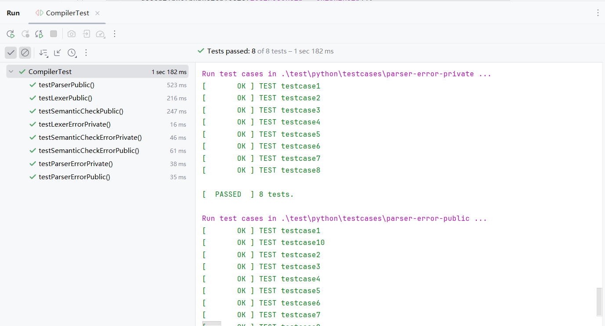

# SysY Compiler

Lab assignments for *Compiling Techniques* @ Beihang University, Fall 2024  

## Usage

TODO

## Test

### Test Cases

Test cases for local testing are located under `test/python/testcases`:

-   Public test case directories have suffixes `-public`.
-   Manually constructed test case directories have suffixes `-private`.

### Test Drivers

#### Lexer & Parser & Semantic Check Test

-   Several redundant Python test scripts are located in the `test/python/` directory.

-   Later, Java versions of JUnit tests were written and are located in the `test/java/` directory.

-   Example

    

#### IR Gen Test

*   Testing the generated LLVM IR requires tools such as `clang`, `lli`, and `llvm-link`. For convenience, testing is performed on a Linux environment rather than a Windows platform.

*   To run the tests, use the following command:

    ```bash
    python3 test/python/code-gen-test.py {test_case_path} {IR_runtime_output_path}
    ```

*   Example

    ```bash
    $ python3 test/python/code-gen-test.py test/python/testcases/code-gen-public/A output.txt
    Run test cases in test/python/testcases/code-gen-public/A ...
    [       OK ] TEST testcase1
    [       OK ] TEST testcase10
    [       OK ] TEST testcase11
    [       OK ] TEST testcase2
    [       OK ] TEST testcase3
    [       OK ] TEST testcase4
    [       OK ] TEST testcase5
    [       OK ] TEST testcase6
    [       OK ] TEST testcase7
    [       OK ] TEST testcase8
    [       OK ] TEST testcase9
    
    [  PASSED  ] 11 tests.
    All tests passed.
    ```

    


