# SysY Compiler

Lab assignments for *Compiling Techniques* @ Beihang University, Fall 2024  

## Implementation


## Pipeline



## Test

**Test Case:**

Test cases for local testing are located under `test/python/testcases`:

-   Public test case directories have suffixes `-public`.
-   Personally constructed test case directories have suffixes `-private`.

**Test Driver:**

*   Testing is preferred to perform on a Linux environment.

*   To run the tests, use the following command:

    ```bash
    python3 test/python/code-gen-test.py {test_case_path} {runtime_output_path} --script {running_script}
    ```

    To test *IR Gen*, set `running_script` to `run-llvm.sh`; to test *Code Gen*, set `running_script` to `run-mips.sh`.
    
*   Example

    ```bash
    $ python3 test/python/code-gen-test.py test/python/testcases/code-gen-private/ output.txt --script run-mips.sh
    Run test cases in test/python/testcases/code-gen-private with script run-mips.sh...
    [       OK ] TEST testcase1
    [       OK ] TEST testcase10
    [       OK ] TEST testcase11
    [       OK ] TEST testcase12
    [       OK ] TEST testcase13
    [       OK ] TEST testcase14
    [       OK ] TEST testcase15
    [       OK ] TEST testcase16
    [       OK ] TEST testcase17
    [       OK ] TEST testcase18
    [       OK ] TEST testcase19
    [       OK ] TEST testcase2
    [       OK ] TEST testcase20
    [       OK ] TEST testcase21
    [       OK ] TEST testcase22
    [       OK ] TEST testcase23
    [       OK ] TEST testcase24
    [       OK ] TEST testcase25
    [       OK ] TEST testcase26
    [       OK ] TEST testcase27
    [       OK ] TEST testcase3
    [       OK ] TEST testcase4
    [       OK ] TEST testcase5
    [       OK ] TEST testcase6
    [       OK ] TEST testcase7
    [       OK ] TEST testcase8
    [       OK ] TEST testcase9
    
    [  PASSED  ] 27 tests.
    All tests passed.
    ```
