<center><h1>SysY Compiler 设计文档</h1></center>


## 第一部分：参考编译器介绍
## 第一部分：参考编译器介绍


*   [ANTLR4](https://github.com/antlr/antlr4)（ANother Tool for Language Recognition）是一个足够现代的语言识别工具，用于生成解析器、解释器或翻译器。它允许开发者定义一种语言的语法规则，然后自动生成能够处理该语言的代码。课程实验中语法单元上下文 Context 的设置、语法分析（以及之后的语义分析、代码生成等 Pass）的 visitor 模式设计都参考自 ANTLR4；
    *   而且 ANTLR4 作为现代的词法分析和语法分析自动生成工具，可以快速检验 local test 用例的合法性，从而帮助本地调试；
*   LLVM IR 是 LLVM 编译基础设施中的一个核心组件。作为一种与平台无关的汇编语言风格的中间代码表示形式，具有静态单赋值形式（SSA），旨在作为各种高级语言编译器前端和优化后端之间的桥梁。在中间代码生成部分以及中端优化部分，笔者参考了 LLVM IR；

)

*   中国科学技术大学的《编译原理与技术》课程从 LLVM IR 中裁剪出了适用于教学的精简的 IR 子集，并将其命名为 Light IR。同时依据 LLVM 的设计，为 Light IR 提供了配套简化的 [C++ 库](https://cscourse.ustc.edu.cn/vdir/Gitlab/compiler_staff/2024ustc-jianmu-compiler/-/tree/main/src/lightir)（[规格书🔗](https://ustc-compiler-2024.github.io/homepage/lab2/LightIR%20C%2B%2B/)），用于生成 IR。笔者重写了该 C++ 库的 Java 版本，作为 IR 生成的 API，应用到课程实验中

*   [Tai-e](https://github.com/pascal-lab/Tai-e) 是一个分析 Java 程序的静态程序分析框架，由南京大学谭添和李樾设计，分为教学版和科研版两个版本。笔者从 [Tai-e（教学版）](https://github.com/pascal-lab/Tai-e-assignments) 剪裁出了数据流分析相关的部分代码，应用到课程实验中，作为中端优化和后端优化的基础设施。

## 第二部分：编译器总体设计

### 文件组织

```bash
.
├── src					# 源代码
│   ├── Compiler.java		# 程序入口
│   ├── backend				# 后端
│   │   ├── core				# 核心部分(代码生成逻辑)
│   │   ├── mips				# mips 管理逻辑
│   │   └── regalloc			# 寄存器分配逻辑
│   ├── config.json			# 配置文件
│   ├── frontend			# 前端
│   │   ├── core				# 核心部分
│   │   ├── error				# 错误处理部分
│   │   ├── llvm				# llvm ir 生成 api 集合
│   │   └── sysy				# sysy 语言相关设置
│   │       ├── context				# 语法单元(上下文设置)
│   │       ├── token				# 词法单元
│   │       └── typesystem			# 类型系统
│   ├── midend				# 中端
│   │   ├── analysis			# 静态分析
│   │   └── optimization		# 中端优化
│   └── utils				# 实用方法(文件读写等)
├── test				# 测试
│   ├── java				# JUnit 单元测试
│   ├── python				# Python 测试驱动
│   │   ├── code-gen-test.py
│   │   ├── ......
│   │   └── testcases		# 测试用例(public对应公共库, private对应local test)
│   │       ├── code-gen-private
│   │       ├── code-gen-public
│   │       ├── grammar-understanding-private
│   │       ├── lexer-error-private
│   │       ├── lexer-public
│   │       ├── livevar-private
│   │       ├── parser-error-private
│   │       ├── parser-error-public
│   │       ├── parser-public
│   │       ├── race-public
│   │       ├── semantic-check-error-private
│   │       ├── semantic-check-error-public
│   │       └── semantic-check-public
│   └── resources			# 测试依赖
│       ├── llvm_ir_io			# llvm ir io 库
│       └── mars				# mips 模拟器
└── ......
```

### 总体结构



## 第三部分：词法分析设计

### 词法单元设计

```java
private Token(TokenType type, String text, int lineno, int colno) {
    this.type = type;		// 类标码
    this.text = text;		// 单词对应字面
    this.lineno = lineno;	// 行号
    this.colno = colno;		// 列号
}
```

### 词法分析器设计

和理论课上以及 tolangc 一行，按照最长匹配的原则利用状态机去接受字符串：

```java
private Token next() {
	......
    if (Character.isAlphabetic(ch) || ch == '_') {
		// 识别标识符和关键字
    } else if (Character.isDigit(ch)) {
		// 识别整数
    } else if (...) {

    } else ...
}
```

### 错误处理

无论是词法分析错误还是语法分析、语义分析的错误处理都是一样。

将分析的逻辑与错误处理的逻辑解耦，采用 **监听者（Listener）模式** 来监听词法分析器、语法分析器和语义分析器，然后监听者来报告错误。

```java
/*      Error Handling is through the whole pipeline        */
errorListener = new ErrorReporter();
......
lexer.addErrorListener(errorListener);
......
parser.addErrorListener(errorListener);
......
semanticCheckVisitor.addErrorListener(errorListener);
```

然后在分析时遇到错误则 **通知（notify）监听者**。

```java
if (ch == '&') {
    ch = stream.getc();
    if (ch == '&') {
        builder.append(ch);
    } else {
        stream.ungetc();
        notifyErrorListeners(lineno, colno, ILLEGAL_SYM);
    }
    return makeToken(AND, builder.toString(), lineno, colno);
}
```

## 第四部分：语法分析设计

### 语法单元/上下文设置

采用和 ANTLR4 类似的方式：

*   为每个非终结符建立各自的  `XXXContext` 类；
*   为所有终结符建立统一的 `TerminalContext` 类。

并提供访问子节点的接口。

*   坏处是要手动反复为每个语法单元建类，过程繁琐；
*   优点是方便后续语义分析、中间代码生成，磨刀不误砍柴工。

### 访问者模式

访问者模式（这里不过多介绍设计模式）是 ANTLR4 提供给用户的接口，是经过实践检验的方便的设计模式，便于扩展需求，天然适用于编译过程中对 AST 的操作，以便后续的语义分析和中间代码生成。

首先抽象出公共的访问者模式接口以及 Base Class

```java
public interface ContextVisitor<T> {
    default T visit(TerminalContext ctx) {return visitDefault(ctx);}
    default T visit(ProgramContext ctx) {return visitDefault(ctx);}
    default T visit(CompUnitContext ctx) {return visitDefault(ctx);}
    default T visit(DeclContext ctx) {return visitDefault(ctx);}
    default T visit(ConstDeclContext ctx) {return visitDefault(ctx);}
    default T visit(BTypeContext ctx) {return visitDefault(ctx);}
    default T visit(ConstDefContext ctx) {return visitDefault(ctx);}
    default T visit(ConstInitValContext ctx) {return visitDefault(ctx);}
	// .....此处省略很多行......
    default T visit(LOrExpContext ctx) {return visitDefault(ctx);}
    default T visit(ConstExpContext ctx) {return visitDefault(ctx);}
    default T visitDefault(Context ctx) {return null;}
}
```

```java
public class BaseContextVisitor<T> implements ContextVisitor<T> {
    @Override
    public T visitDefault(Context ctx) {
        T r = null;
        for (Context child : ctx.getChildren()) {
            r = child.accept(this);
        }
        return r;
    }
}
```

后面的语义分析和中间代码生成只需要各自集成 Base Class，然后专注于自己的业务逻辑，在 visit 某个节点的时候做一些动作，而无需关心怎么遍历语法树。

```java
public class SemanticCheckVisitor extends BaseContextVisitor<Type> {}
```

```java
public class IRGenVisitor extends BaseContextVisitor<Value> {}
```

### ~~面向对象的~~函数式编程的语法解析

在正是进行语法分析的时候，我是为每个语法单元写一个方法，并且提前看若干给 token。但这个方法实在吃力不讨好，极其繁琐，极其容易出错，代码极其臃肿丑陋。

后来我看到 [Toby-Shi](https://github.com/Toby-Shi-cloud/SysY-Compiler-2023) 学长的采用了一种声明式的解析方法，就像哥伦布发现了新大陆！！优雅！！实在是优雅！！！

这样的声明式编程基于函数式编程，提供 $4$ 个基本“运算符”（有点类似正则表达式）

```java  
private static Generator cat(Generator... generators) {}	// 拼接
public static Generator or(Generator... generators) {}		// 或
public static Generator option(Generator gen) {}			// 可选
public static Generator any(Generator gen){}				// 任意数量
```

让函数去生成函数，生成的函数又去生成函数……从而实现了一种介于手动解析和自动解析之间的半自动方法。

如下面所示，**解析一个语法单元只需要编写一行代码**，而不需要像原来一样编写臃肿丑陋的几十上百行代码。

```java
// 变量声明 VarDecl → BType VarDef { ',' VarDef } ';'
case VarDecl ->         cat(gen(BType),
                            gen(VarDef),
                            any(cat(gen(COMMA), gen(VarDef))),
                            gen(SEMICN, MISSING_SEMICOLON));

// 变量定义 VarDef → Ident [ '[' ConstExp ']' ] | Ident [ '[' ConstExp ']' ] '=' InitVal
case VarDef ->          cat(gen(IDENFR),
                            option(cat(gen(LBRACK), gen(ConstExp), gen(RBRACK, MISSING_RBRACK))),
                            option(cat(gen(ASSIGN), gen(InitVal))));

// 变量初值 InitVal → Exp | '{' [ Exp { ',' Exp } ] '}' | StringConst
case InitVal ->          or(gen(Exp),
                            cat(gen(LBRACE), option(cat(gen(Exp), any(cat(gen(COMMA), gen(Exp))))), gen(RBRACE)),
                            gen(STRCON));

// 函数定义 FuncDef → FuncType Ident '(' [FuncFParams] ')' Block
case FuncDef ->         cat(gen(FuncType),
                            gen(IDENFR),
                            gen(LPARENT),
                            option(gen(FuncFParams)),
                            gen(RPARENT, MISSING_RPARENT),
                            gen(Block));

```

## 第五部分：语义分析设计

**语义分析与中间代码生成分离**，各自负责各自的逻辑。语义分析就专注语义分析，从而中间代码生成的时候，可以基于某种规格“大胆地假设”错误已经得到处理，而不用陷入万劫不复的细节考虑之中。

### 符号表

既然二者分离了，那符号表也肯定不是一样了。考虑设计一个符号表的泛型类，主要提供如下接口

```java
public class SymbolTable<T> {
    public void define(String name, T value) {}	// 填表
    public T localResolve(String name) {}		// 解析查询(在本层符号表解析)
    public T globalResolve(String name) {}		// 解析查询(从本层符号表不断向上解析)
}
```

*   语义分析主要负责类型检查，那往符号表里填的 `T` 就是 `Type`。
*   LLVM IR 中一切皆 Value，那中间代码生成时往符号表里填的 `T` 就是 `Value`。

### 语义分析

语义分析器集成 visitor 的基类，在 **visit 与某条语义规则有关的节点时“做一些动作”**，进行检查。

```java
public class SemanticCheckVisitor extends BaseContextVisitor<Type> {
    @Override
    public Type visit(BlockContext ctx) {
		// do something
    }
    @Override
    public Type visit(VarDeclContext ctx) {
		// do something
    }
    @Override
    public Type visit(VarDefContext ctx) {
		// do something
    }
	......
}
```

## 第六部分：代码生成设计

### LLVM IR 生成

和语义分析类似，visitor 继承 base class，在 visit 相关节点是进行必要的操作，包括：

*   生成基本块并处理基本块之间的关系
*   生成 LLVM IR 指令
*   填符号表与查符号表
*   传递与接收继承属性和综合属性

```java
public class IRGenVisitor extends BaseContextVisitor<Value> {}
```

注意到 `visitXXX` 方法返回值类型是 `Value`，这也是出于 LLVM IR 中一切皆 Value 的设计。

### MIPS 设计

经过前面的步骤，相比于几十种语法单元，现在只需要处理 10 余种 LLVM IR 指令，将每种指令翻译成等价的若干条 MIPS 指令即可。

```java
private class InstGenerator implements InstVisitor<Void> {
    @Override
    public Void visit(MoveInst inst) {
        // do something
    }
    @Override
    public Void visit(PhiInst inst) {
        throw new RuntimeException("MIPS backend does not support generation from phi. " +
                "Did you eliminate the phi(s) before generation?");
    }
    @Override
    public Void visit(LoadInst inst) {
        // do something
    }
    @Override
    public Void visit(StoreInst inst) {
        // do something
    }
    @Override
    public Void visit(BranchInst inst) {
        // do something
    }
    @Override
    public Void visit(AllocaInst inst) {
        // do something
    }
    @Override
    public Void visit(CallInstr inst) {
        // do something
    }
    @Override
    public Void visit(ReturnInst inst) {
            // do something
    }
    @Override
    public Void visit(GetElementPtrInst inst) {
            // do something
    }
    @Override
    public Void visit(CastInst inst) {
        // do something
    }
    @Override
    public Void visit(IBinaryInst inst) {
        // do something
    }
}
```

### 寄存器分配

>   *在优化之前（如果寄存器分配算优化的话）需要栈式分配，怎样写出可扩展的代码？*

考虑将“寄存器分配”这个动作封装为一个接口：

```java
public interface RegAllocator {
    public Map<Value, Register> allocate(Function function);
	public List<Register> getUsedSavadRegs();
}
```

在正式分配之前，**“不分配”也是分配**，也作为一种分配策略，作为“寄存器分配”的基类

```java
public class BaseRegAllocator implements RegAllocator {
    protected List<Register> usedSavadRegs = new ArrayList<>();

    @Override
    public Map<Value, Register> allocate(Function function) {
        return Map.of();
    }

    @Override
    public List<Register> getUsedSavadRegs() {
        return usedSavadRegs;
    }
}
```

然后再扩展具体的分配策略

```java
public class LinearScanRegAllocator extends BaseRegAllocator {}
```

这样将寄存器分配的逻辑和目标代码生成的逻辑解耦，方便迭代扩展。

## 第七部分：代码优化设计

除去一些细枝末节的局部优化之外，主要实现的优化包括：

*   Mem2Reg
*   死代码删除
*   线性扫描寄存器分配（如果寄存器分配也算优化的话）

详见优化文档。