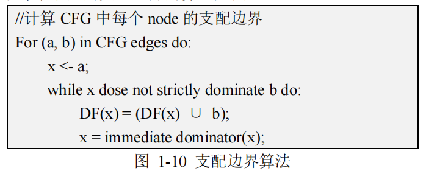
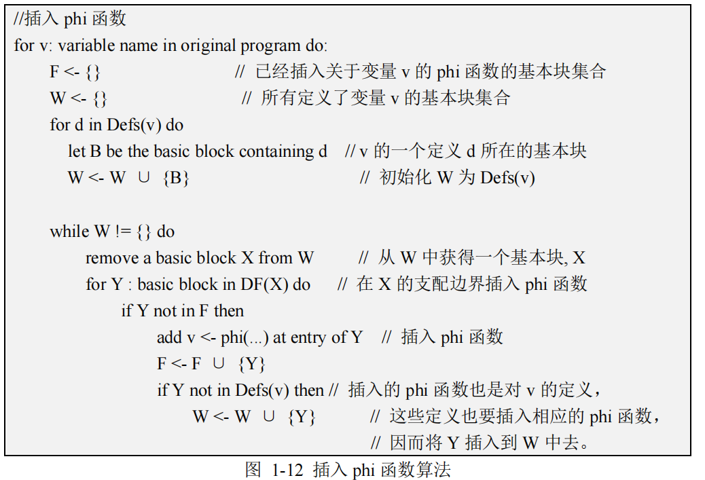
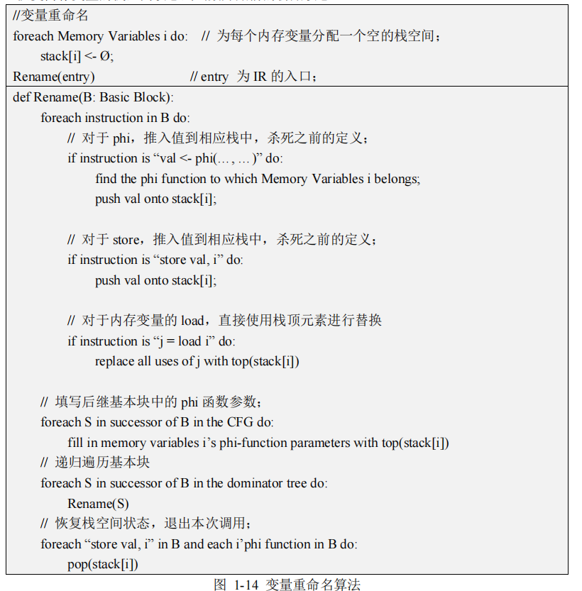
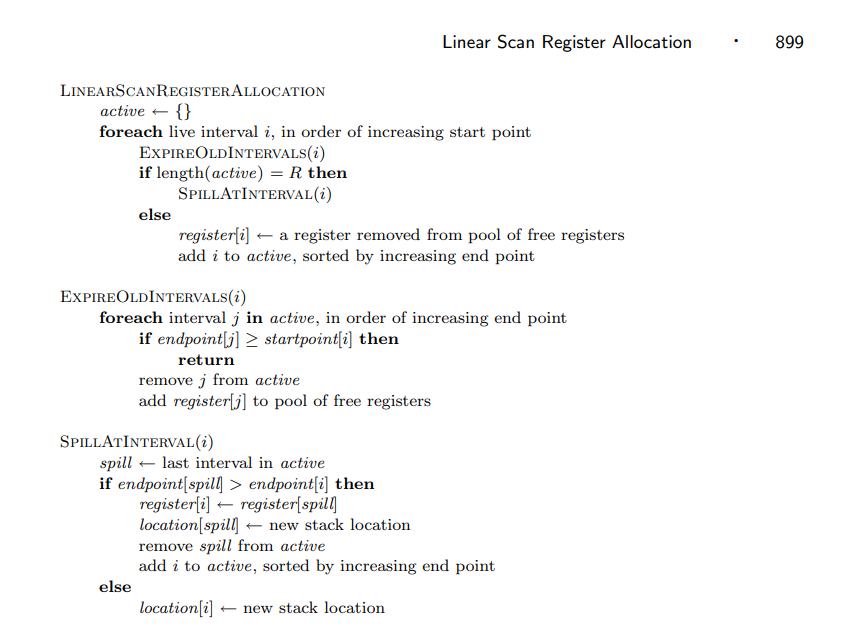

<center><h1>编译优化文档</h1></center>


## 第零部分：总览

在优化的实践过程中，可以发现全局优化功效极大于局部优化。笔者所完成优化主要包括：

*   中端优化
    *   死代码删除（影响 $\text{Final Cycle}$ 的主要是无用赋值部分）
    *   Mem2Reg（消除 LLVM IR 中可提升的 `Alloca` 指令）
*   后端优化
    *   寄存器分配（线性扫描寄存器分配）

如下图所示，为了实现中端优化和后端优化，还必须搭建好优化的“基础设施”：

*   静态分析
    *   数据流分析 — 活跃变量分析
    *   数据流分析 — 支配关系分析



<center>编译优化总览</center>

## 第一部分：静态分析

需要用到的静态分析主要是数据流分析，包括活跃变量分析（寄存器分配和死代码删除的前驱条件）和支配关系分析（Mem2Reg 的前驱条件）。这里不把二者分隔开来讲，而是用一种更统一的视角来分析。

数据流分析，大致的框架都是利用迭代求解来达到不动点（Fixed Point）：


<center>数据流分析算法（来自南京大学《静态分析》）</center>

只不过对于不同的分析有不同的 $(1)$ Domain，$(2)$ Direction，$(3)$ May/Must，$(4)$ Boundary，$(5)$ Initialization，$(6)$ Transfer function， $(7)$ Meet。


<center>不同数据流分析的比较（来自南京大学《静态分析》）</center>

即，我们可以将一个数据流分析描述为 
$$
DFA=\left<Domain,Direction,May/Must,Boundary,Initialization,Transfer\, function,Meet\right>
$$
下面是笔者总结的到达定义分析、活跃变量分析、可用表达式分析、常量传播与支配关系的比较。

|                            |  Reaching Definitions   |     Live Variables      |  Available Expressions  |  Constant Propagation   |       Domination        |
| :------------------------: | :---------------------: | :---------------------: | :---------------------: | :---------------------: | :---------------------: |
|           Domain           |   Set of definitions    |    Set of variables     |   Set of expressions    |   Set of pairs (x, v)   |   Set of Basic Blocks   |
| Abstraction Representation |  Bit Vector / Set Fact  |  Bit Vector / Set Fact  |  Bit Vector / Set Fact  |        Map Fact         |        Set Fact         |
|         Direction          |        Forwards         |        Backwards        |        Forwards         |        Forwards         |        Forwards         |
|          May/Must          |           May           |           May           |          Must           |          Must           |          Must           |
|          Boundary          |     OUT[entry] = ⊥      |      IN[exit] = ⊥       |     OUT[entry] = ⊥      |     OUT[entry] = ⊥      |     OUT[entry] = ⊥      |
|       Initialization       |       OUT[B] = ⊥        |        IN[B] = ⊥        |       OUT[B] = ㄒ       |       OUT[B] = ㄒ       |       OUT[B] = ㄒ       |
|     Transfer function      | OUT = gen U (IN - kill) | IN = gen U (OUT - kill) | OUT = gen U (IN - kill) | OUT = gen U (IN - kill) | OUT = gen U (IN - kill) |
|            Meet            |            ⊔            |            ⊔            |            ⊓            |            ⊓            |            ⊓            |
|       Distributivity       |      distributive       |      distributive       |      distributive       |     nondistributive     |        还没思考         |

对于要用到的活跃变量分析
$$
\text{OUT}(B)=\bigcup_{S,\text{a successor of }B}\text{IN}(S)
$$

$$
\text{IN}(B)=use_{B } \cup(\text{OUT}(B)-def_{B})
$$

对于支配关系分析
$$
\text{IN}(B)=\bigcap_{P,\text{a predecessor of }B}\text{OUT}(P)
$$

$$
\text{OUT}(B)=\{B\} \cup(\text{IN}(B)-\phi)
$$

活跃变量分析理论课上已经烂熟了，这里就不再赘述。为什么支配关系分析的 transfer function 和 meet 是这样的呢？

*   因为基本块 $B$ 必然支配自己，所以 $\text{OUT}(B)=\{B\} \cup(\text{IN}(B)-\phi)$；
*   对于从入口出发的基本块只有所有路径都支配 $B$ 才能称这个基本块支配 $B$，所以 $\text{IN}(B)=\bigcap_{P,\text{a predecessor of }B}\text{OUT}(P)$。

## 第二部分：中端优化

### 死代码删除

有了活跃变量分析就能进行死代码删除，这里只考虑显著影响 $\text{Final Cycle}$ 的无用赋值。

>   **Note 1**
>
>   *什么是无用赋值？*

对于 LLVM IR
$$
I_{s}:\mathtt{\%op}_{i}=...
$$
如果活跃变量分析结果中 $\mathtt{\%op}_{i}\notin \text{OUT}(I_{s})$，即 $\mathtt{\%op}_{i}$ 这个 Value 不在被后面的其他 Value 所使用，那这个赋值是无用赋值，我们可以将其删去。

>   **Note 2**
>
>   *“这样”的无用赋值都应该删去吗？*

对于有副作用的语句，我们应该舍弃精度，作保守估计，不将其删除。

哪些语句有副作用：

*   数组的存取显然有副作用；
*   全局变量的存取显然有副作用；
*   函数调用显然有副作用；
*   跳转语句显然有副作用（因为跳转到的基本块可能包含上面的副作用语句）
*   ……

于是语句能被删除的充要条件就清楚了：

1.   语句对应 Value 不再活跃；
2.   语句没有副作用。

```java
if (hasNoSideEffect(inst) && !liveVars.getResult(inst).contains(defVal)) {
    inst.eraseFromParent();
    changed = true;
}
```

>   **Note **3
>
>   *一次删除就删“干净”了吗？*

一次删除之后，就会又影响活跃变量分析的格局，就又可能产生新的无用赋值。

所以这里的死代码删除其实也类似迭代算法，最终达到不动点。

```java
private void run(Function function) {
    boolean changed;
    do {
        changed = singlePass(function);
    } while (changed);
}
```

### Mem2Reg

Mem2Reg 的实现要点已经注意点全部都在算法里了，需要“老老实实”地在支配关系上完成 $3$ 个步骤：

0.   支配关系分析；

1.   计算支配边界；
2.   插入 $\phi$ 函数；
3.   变量重命名。

对应算法如下（参考 [Mem2Reg介绍.pdf](https://ustc-compiler-2024.github.io/homepage/lab4/Mem2Reg介绍.pdf)）：









最终也就对应了如下 API：

```java
public Map<BasicBlock, SetFact<BasicBlock>> computeDominanceFrontier(Function function);
public void insertPhiFunctions(Function function);
public void rename(Function function);
```

由于算法“庞大”，前后勾连，一不留神就容易出现 BUG 🐞，所以需要做好单元测试和集成测试。

## 第三部分：后端优化

### 寄存器分配

笔者没有使用图着色分配，而是使用了线性扫描寄存器分配。



<center>线性扫描寄存器分配算法</center>

比起图着色，只需实现半张 A4 纸不大的算法就能获得不错的性能提示！性价比 🆙🆙🆙！！！

具体算法就不赘述，这里着重讲一些 tricky 的地方。

>   **Note **4
>
>   *怎么计算活跃区间 Interval？*

常用的方式是采用 DFS 遍历 CFG 得到 DFN 作为语句的编号，然后以其活跃的最小编号点作为左端点，活跃的最大编号点作为右端点。形式地讲，如下面所示
$$
start(v)=\min_{s\in CFG}\left\{dfn(s)\mid v \in \mathtt{OUT}(s)\right\}
$$

$$
end(v)=\max_{s\in CFG}\left\{dfn(s)\mid v \in \mathtt{IN}(s)\right\}
$$

$$
\text{Interval}(v)=\left[start(v),end(v)\right]
$$

>   **Note 5**
>
>   *在优化之前（如果寄存器分配算优化的话）需要栈式分配，怎样写出可扩展的代码？*

考虑将“寄存器分配”这个动作封装为一个接口：

```java
public interface RegAllocator {
    public Map<Value, Register> allocate(Function function);
	public List<Register> getUsedSavadRegs();
}
```

在正式分配之前，**“不分配”也是分配**，也作为一种分配策略，作为“寄存器分配”的基类

```java
public class BaseRegAllocator implements RegAllocator {
    protected List<Register> usedSavadRegs = new ArrayList<>();

    @Override
    public Map<Value, Register> allocate(Function function) {
        return Map.of();
    }

    @Override
    public List<Register> getUsedSavadRegs() {
        return usedSavadRegs;
    }
}
```

然后再扩展具体的分配策略

```java
public class LinearScanRegAllocator extends BaseRegAllocator {}
```

这样讲寄存器分配的逻辑和目标代码生成的逻辑解耦，方便迭代扩展。

>   **Note 6（小插曲）**
>
>   *笔者还实现了一些功效甚微的局部优化？比如 LVN，但在不同测试用例上出现了反向优化和正向优化，为何？*
>
>   | LVN前 | LVN后 |  备注  |
>   | :---: | :---: | :----: |
>   | 8761  | 9561  | 负优化 |
>   | 10790 | 10763 | 正优化 |

LVN 主要是针对公开的 testcase7 做的局部优化。实现 LVN 之后的确有一点功效（也就只有一点），但其他用例出现反向优化，这是为什么？

笔者推测原因是 LVN 消除局部公共子表达式之后，部分公共子表达式对应的 Value 被后面更多的语句复用，也就是“蔓延”到更后面了，即活跃区间 Interval 扩大了。

原来多而小又细碎的活跃区间可能更适合线性扫描分配，但公共子表达式活跃区间扩大，与更多其他变量的活跃区间产生交叠，从而 **极大程度“扰动”了活跃区间的格局**，使得寄存器分配出现负优化。

这样说明了线性扫描分配虽然投入产出快，但也伴随很多缺陷。

## 参考资料

*   Live Variable Analysis
    *   https://tai-e.pascal-lab.net/pa1.html
*   Linear Scan Register Allocation
    *   https://web.cs.ucla.edu/~palsberg/course/cs132/linearscan.pdf
    *   https://www.cnblogs.com/AANA/p/16315921.html
*   复用数据流分析框架分析支配关系
    *   https://www.penlab.me/2020/12/06/loops/

*   Mem2Reg 介绍
    *   https://ustc-compiler-2024.github.io/homepage/lab4/Mem2Reg%E4%BB%8B%E7%BB%8D.pdf