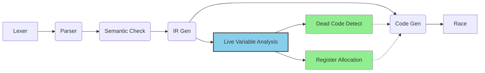

# Schedule (Fall 2024)

## Pipeline

*   Lexer :heavy_check_mark:
*   Parser :heavy_check_mark:
*   Semantic Check :heavy_check_mark: 
*   IR Gen :heavy_check_mark: <font color=green>*(Nov 3, 2024)*</font>
*   Code Gen :heavy_check_mark:  <font color=green>*(Nov 8, 2024)*</font>
*   Race :runner:
    *   Live Variable Analysis :heavy_check_mark:  <font color=green>*(Nov 9, 2024)*</font>
        *   Dead Code Detect  :heavy_check_mark:<font color=green>*(Nov 12, 2024)*</font>
        *   Register Allocation  :heavy_check_mark:<font color=green>*(Nov 11, 2024)*</font>

    *   Mem2Reg `TBD`




<center>Dependency</center>

<center><em>(<font color=purple>purple</font> is for <font color=purple>Compiler Pipeline</font>, <font color=#87CEEB>blue</font> is for <font color=#87CEEB>Static Analysis</font> and <font color=#90EE90>green</font> is for <font color=#90EE90>Optimization</font>)</em></center>

## Optimization

Scoring Criteria:
$$
\text{FinalCycle} = \text{DIV}\cdot50+\text{MULT}\cdot3 + \text{JUMP/BRANCH} \cdot 3 + \text{MEM} \cdot 4 + \text{OTHER} \cdot 1
$$


### Before Optimization

*   The most sound solution:

    |  1   |   2   |   3   |  4   |      5      |     6      |   7   |      8       |
    | :--: | :---: | :---: | :--: | :---------: | :--------: | :---: | :----------: |
    | 8876 | 27207 | 38229 | 1824 | 7.9707964E7 | 2.378052E7 | 32533 | 1.43739417E8 |

*   Romove the maintenance of `$s` registers in the function prologue and epilogue.

    *(Since register allocation is applied yet!)*

    |  1   |   2   |   3   |  4   |      5      |      6      |   7   |      8       |
    | :--: | :---: | :---: | :--: | :---------: | :---------: | :---: | :----------: |
    | 8620 | 20935 | 36693 | 1568 | 7.7787836E7 | 1.7981224E7 | 24597 | 1.43739289E8 |

*   1121

    |  1   |   2   |   3   |  4   |      5      |      6      |   7   |      8       |
    | :--: | :---: | :---: | :--: | :---------: | :---------: | :---: | :----------: |
    | 8610 | 20925 | 36683 | 1558 | 7.7787826E7 | 1.7981214E7 | 24587 | 1.43739279E8 |

### Linear Scan Register Allocation

*   2

    |                        | 1    | 2     | 3     | 4    | 5           | 6           | 7     | 8            |
    | :--------------------: | ---- | ----- | ----- | ---- | ----------- | ----------- | ----- | ------------ |
    |                        | 8876 | 27207 | 38229 | 1824 | 7.9707964E7 | 2.378052E7  | 32533 | 1.43739417E8 |
    |                        | 8620 | 20935 | 36693 | 1568 | 7.7787836E7 | 1.7981224E7 | 24597 | 1.43739289E8 |
    |                        | 8610 | 20925 | 36683 | 1558 | 7.7787826E7 | 1.7981214E7 | 24587 | 1.43739279E8 |
    |   线性扫描寄存器分配   | 3758 | 11561 | 10199 | 864  | 3.2231401E7 | 1.0850068E7 | 12983 | 3.7431043E7  |
    |                        | 3757 | 11354 | 10196 | 851  | 3.1661203E7 | 1.0809331E7 | 12746 | 3.7401036E7  |
    |                        | 3757 | 11264 | 10196 | 851  | 3.0761203E7 | 1.0745719E7 | 12743 | 3.7401036E7  |
    |       死代码删除       | 283  | 11264 | 10196 | 841  | 3.0711203E7 | 1.0474202E7 | 12733 | 3.7401036E7  |
    |                        | 283  | 11256 | 10038 | 835  | 3.0501203E7 | 1.0399033E7 | 12722 | 3.7391035E7  |
    |                        | 279  | 11158 | 10014 | 831  | 3.0471201E7 | 1.0308419E7 | 12598 | 3.7391033E7  |
    |                        | 279  | 11158 | 10014 | 831  | 2.9930942E7 | 1.0303929E7 | 12579 | 3.7391033E7  |
    |                        | 275  | 11060 | 9990  | 827  | 2.990094E7  | 1.0213315E7 | 12455 | 3.7391031E7  |
    |                        | 275  | 11060 | 9990  | 827  | 2.990094E7  | 1.0213315E7 | 685   | 3.7391031E7  |
    | 寄存器分配边界条件放宽 | 247  | 10280 | 9802  | 799  | 2.9660932E7 | 9487543     | 685   | 3.5967479E7  |
    |                        | 130  | 8809  | 8776  | 665  | 2.5619816E7 | 7492168     | 10814 | 2.2781296E7  |
    |                        | 130  | 8809  | 8776  | 665  | 2.5619816E7 | 7119352     | 10814 | 2.2781296E7  |
    |                        | 127  | 8809  | 8764  | 658  | 2.5489432E7 | 6991804     | 10814 | 2.1357756E7  |
    |                        | 111  | 8761  | 8744  | 630  | 2.5489412E7 | 6991760     | 10790 | 2.1357748E7  |
    |                        | 111  | 8761  | 8744  | 630  | 2.5329412E7 | 6720896     | 10790 | 2.1357756E7  |
    |                        | 111  | 8761  | 8744  | 623  | 2.5489412E7 | 6626072     | 10790 | 2.1357756E7  |
    |                        | 111  | 8761  | 9561  | 623  | 2.5489412E7 | 6707774     | 10763 | 2.1357748E7  |

```java
/*
 * SysYCompiler: A Compiler for SysY.
 *
 * SysYCompiler is an individually developed course project
 * for Compiling Techniques @ School of Computer Science &
 * Engineering, Beihang University, Fall 2024.
 *
 * Copyright (C) 2024 Yixuan Kuang <kyee22@buaa.edu.cn>
 *
 * This file is part of SysYCompiler.
 */

package backend.core;

import backend.mips.Manager;
import backend.mips.Register;
import frontend.llvm.Module;
import frontend.llvm.type.IntegerType;
import frontend.llvm.type.Type;
import frontend.llvm.value.Argument;
import frontend.llvm.value.BasicBlock;
import frontend.llvm.value.Function;
import frontend.llvm.value.Value;
import frontend.llvm.value.user.GlobalVariable;
import frontend.llvm.value.user.constant.ConstantInt;
import frontend.llvm.value.user.instr.*;
import utils.FileUtils;

import java.util.ArrayList;
import java.util.HashMap;
import java.util.List;
import java.util.Map;
import java.util.stream.Collectors;

import static backend.core.ASMBuilder.*;
import static backend.mips.Manager.*;
import static backend.mips.Register.*;

public class ASMGenerator {
    private ASMBuilder builder = new ASMBuilder();
    private Map<Value, String> glbMap = new HashMap<>();
    private Map<Value, Register> regMap = new HashMap<>();
    private Map<Value, Integer> memMap = new HashMap<>();
    private Manager manager = new Manager();
    private InstGenerator instGenerator = new InstGenerator();

    // todo 立即数过大?

    public void genFrom(Module module) {
        builder.init();

        builder.setSegment(SEG_DATA);
        for (GlobalVariable globalVar : module.getGlobalVariables()) {
            builder.buildGloabalVar(globalVar);
            glbMap.put(globalVar, globalVar.getName());
        }

        builder.setSegment(SEG_TEXT);

        List<Function> functions = new ArrayList<>();
        for (Function function : module.getFunctions()) {
            if ("main".equals(function.getName())) {
                functions.add(function);
                break;
            }
        }
        for (Function function : module.getFunctions()) {
            if (!"main".equals(function.getName())) {
                functions.add(function);
            }
        }

        for (Function function : functions) {
            if (function.isDeclaration()) {
                continue;
            }
            manager.releaseAllReservedTmpReg();
            prologue(function);
            function.setInstrName();
            for (BasicBlock bb : function.getBasicBlocks()) {
                builder.buildLabel(getBasicBlockLabel(bb));
                for (Instruction inst : bb.getInstrs()) {
                    builder.buildComment(inst.print());
                    manager.releaseAllReservedTmpReg();
                    inst.accept(instGenerator);
                    builder.buildBreak();
                }
            }
            epilogue(function);
        }
    }

    private void prologue(Function function) {
        // 函数序言
        builder.buildLabel(getFunctionPrologueLabel(function));
        // 预分配栈帧大小
        manager.allocFrame(function);
        // 记录得到寄存器分配的 Value 映射
        regMap.putAll(manager.getRegMap());

        //Register tmpReg = resolveConstant(manager.getFrameSize());
        builder.buildSubu(REG_SP, REG_SP, resolveConstant(manager.getFrameSize()));
        builder.buildSw(REG_RA, REG_SP, manager.getRaOffset());
        List<Register> usedSavadRegs = manager.getUsedSavadRegs();
        for (int i = usedSavadRegs.size() - 1; i >= 0; --i) {
            builder.buildSw(usedSavadRegs.get(i), REG_SP, manager.getSaveOffset() + i * WORD_SIZE);
        }
    }

    private void epilogue(Function function) {
        // 函数尾声
        builder.buildLabel(getFunctionEpilogueLabel(function));
        List<Register> usedSavadRegs = manager.getUsedSavadRegs();
        for (int i = 0; i < usedSavadRegs.size(); ++i) {
            builder.buildLw(usedSavadRegs.get(i), REG_SP, manager.getSaveOffset() + i * WORD_SIZE);
        }
        builder.buildLw(REG_RA, REG_SP, manager.getRaOffset());
        builder.buildAddiu(REG_SP, REG_SP, manager.getFrameSize());
        if (function.getName().equals("main")) {
            builder.buildLi(REG_V0, SYS_NO_EXIT);
            builder.buildSyscall();
        } else {
            builder.buildJr(REG_RA);
        }
    }

    private class InstGenerator implements InstVisitor<Void> {
        @Override
        public Void visit(LoadInst inst) {
            Register rd = pull(inst);
            Register rs = pull(inst.getOperand(0));
            buildLoad(inst.getType().getSize(), rd, rs, 0);
            push(rd, inst);
            return null;
        }

        @Override
        public Void visit(StoreInst inst) {
            Value src = inst.getOperand(0), dest = inst.getOperand(1);
            Register rs = (src instanceof ConstantInt c)
                            ? resolveConstant(c.getValue())
                            : pull(src);
            Register rd = pull(dest);
            buildStore(src.getType().getSize(), rs, rd, 0);
            return null;
        }

        @Override
        public Void visit(BranchInst inst) {
            if (!inst.isCondBr()) {
                builder.buildJ(getBasicBlockLabel((BasicBlock) inst.getOperand(0)));
            } else {
                Register cond = (inst.getOperand(0) instanceof ConstantInt c)
                                    ? resolveConstant(c.getValue())
                                    : pull(inst.getOperand(0));
                builder.buildBne(REG_ZERO, cond, getBasicBlockLabel((BasicBlock) inst.getOperand(1)));
                builder.buildJ(getBasicBlockLabel((BasicBlock) inst.getOperand(2)));
            }
            return null;
        }

        @Override
        public Void visit(AllocaInst inst) {
            Register destReg = pull(inst);
            builder.buildAddiu(destReg, REG_SP, manager.alloc(inst.getAllocaType().getSize()));
            push(destReg, inst);
            return null;
        }

        @Override
        public Void visit(CallInstr inst) {
            Function callee = (Function) inst.getOperand(0);
            // todo: 库函数
            for (int i = 1; i < inst.getNumOperand(); ++i) {
                int argno = i - 1;
                Register arg = (inst.getOperand(i) instanceof ConstantInt c)
                                ? resolveConstant(c.getValue())
                                : pull(inst.getOperand(i));
                if (argno <= 3) {
                    builder.buildMove(ARG_REGS[argno], arg);
                } else {
                    buildStore(inst.getOperand(i).getType().getSize(), arg, REG_SP, argno * WORD_SIZE);
                }

                if (manager.isReservedTmpReg(arg)) {
                    manager.releaseReservedTmpReg(arg);
                }
            }
            if (callee.isDeclaration()) {
                int sysNo = switch (callee.getName()) {
                    case "getint" -> SYS_NO_READ_INT;
                    case "getchar" -> SYS_NO_READ_CHR;
                    case "putint" -> SYS_NO_PRINT_INT;
                    case "putch" -> SYS_NO_PRINT_CHR;
                    case "putstr" -> SYS_NO_PRINT_STR;
                    default -> throw new IllegalStateException("Unexpected lib call: " + callee.getName());
                };
                builder.buildLi(REG_V0, sysNo);
                builder.buildSyscall();
            } else {
                builder.buildJal(getFunctionPrologueLabel(callee));
            }

            if (!callee.getReturnType().isVoidType()) {
                Register rd = pull(inst);
                builder.buildMove(rd, REG_V0);
                push(rd, inst);
            }
            return null;
        }

        @Override
        public Void visit(ReturnInst inst) {
            if ("main".equals(inst.getFunction().getName())) {
                builder.buildLi(REG_V0, SYS_NO_EXIT);
                builder.buildSyscall();
                return null;
            }
            if (!inst.isVoidReturn()) {
                Value op =inst.getOperand(0);
                Register rs = (op instanceof ConstantInt c)
                                ? resolveConstant(c.getValue())
                                : pull(op);
                builder.buildMove(REG_V0, rs);
            }
            builder.buildJ(getFunctionEpilogueLabel(inst.getFunction()));
            return null;
        }

        @Override
        public Void visit(GetElementPtrInst inst) {
            Value ptr = inst.getOperand(0);
            Type ty = ptr.getType().getPointerElementType();

            List<Integer> offsetSizes = new ArrayList<>();
            List<Value> offsets = new ArrayList<>();

            for (int i = 1; i < inst.getNumOperand(); ++i) {
                Value offset = inst.getOperand(i);
                if (!(offset instanceof ConstantInt c && c.getValue() == 0)) {
                    offsetSizes.add(ty.getSize());
                    offsets.add(offset);
                }
                if (i < inst.getNumOperand() - 1) {
                    ty = ty.getArrayElementType();
                }
            }

            Register base = pull(ptr), rd = pull(inst);
            if (offsetSizes.isEmpty()) {
                builder.buildMove(rd, base);
                push(rd, inst);
                return null;
            }

            Register rs, tmpReg = manager.getReservedTmpReg();
            for (int i = 0; i < offsetSizes.size(); ++i) {
                rs = (offsets.get(i) instanceof ConstantInt c)
                        ? resolveConstant(c.getValue())
                        : pull(offsets.get(i));
                switch (offsetSizes.get(i)) {
                    case 1 -> tmpReg = rs;
                    case 4 -> builder.buildSll(tmpReg, rs, 2);
                    default -> throw new RuntimeException("Unexpected offset size: " + offsetSizes.get(i));
                }

                if (manager.isReservedTmpReg(rs)) {
                    manager.releaseReservedTmpReg(rs);
                }
                if (i == 0) {
                    builder.buildAddu(rd, base, tmpReg);
                    if (manager.isReservedTmpReg(base)) {
                        manager.releaseReservedTmpReg(base);
                    }
                } else {
                    builder.buildAddu(rd, rd, tmpReg);
                }
            }
            push(rd, inst);
            return null;
        }

        @Override
        public Void visit(CastInst inst) {
            Value op = inst.getOperand(0);
            if (op instanceof ConstantInt) {
                throw new RuntimeException("did you solve the compile-time constant when generating ir?");
            }
            Register rs = pull(op);
            Register rd = pull(inst);
            switch (inst.getInstrType()) {
                case ZEXT -> builder.buildMove(rd, rs);
                case TRUNCT -> {
                    int mask = (1 << ((IntegerType) inst.getDestType()).getNumBits()) - 1;
                    builder.buildAndi(rd, rs, mask);
                }
                default -> throw new RuntimeException("unknown instruction type: " + inst.getInstrType());
            }
            push(rd, inst);
            return null;
        }

        @Override
        public Void visit(ICmpInst inst) {
            Value op1 = inst.getOperand(0), op2 = inst.getOperand(1);
            if (op1 instanceof ConstantInt && op2 instanceof ConstantInt) {
                throw new RuntimeException("error @ " + inst.print() + ". did you solve the compile-time constant when generating ir?");
            }
            Register rd = pull(inst);
            Register rs1 = (op1 instanceof ConstantInt c1) ? resolveConstant(c1.getValue()) : pull(op1);
            Register rs2 = (op2 instanceof ConstantInt c2) ? resolveConstant(c2.getValue()) : pull(op2);
            switch (inst.getInstrType()) {
                case LT -> builder.buildSlt(rd, rs1, rs2);
                case LE -> builder.buildSle(rd, rs1, rs2);
                case GT -> builder.buildSgt(rd, rs1, rs2);
                case GE -> builder.buildSge(rd, rs1, rs2);
                case EQ -> builder.buildSeq(rd, rs1, rs2);
                case NE -> builder.buildSne(rd, rs1, rs2);
                default -> throw new RuntimeException("unknown instr type");
            }
            push(rd, inst);
            return null;
        }

        @Override
        public Void visit(IBinaryInst inst) {
            Value op1 = inst.getOperand(0), op2 = inst.getOperand(1);
            if (op1 instanceof ConstantInt && op2 instanceof ConstantInt) {
                throw new RuntimeException("did you solve the compile-time constant when generating ir?");
            }
            if (checkAddPerf(inst) || checkMultPerf(inst)) {
                return null;
            }
            Register rd = pull(inst);
            Register rs1 = (op1 instanceof ConstantInt c1) ? resolveConstant(c1.getValue()) : pull(op1);
            Register rs2 = (op2 instanceof ConstantInt c2) ? resolveConstant(c2.getValue()) : pull(op2);
            switch (inst.getInstrType()) {
                case ADD -> builder.buildAddu(rd, rs1, rs2);
                case SUB -> builder.buildSubu(rd, rs1, rs2);
                case MUL -> builder.buildMul(rd, rs1, rs2);
                case SDIV -> builder.buildDiv(rd, rs1, rs2);
                case SREM -> builder.buildRem(rd, rs1, rs2);
                default -> throw new RuntimeException("Unsupported inst type: " + inst.getInstrType());
            }
            push(rd, inst);
            return null;
        }
    }

    private Register resolveConstant(int num) {
        if (num == 0) {
            return REG_ZERO;
        }
        Register tmpReg = manager.getReservedTmpReg();
        if (!canImmediateHold(num)) {
            builder.buildLui(tmpReg, getHigh16Bits(num));
            builder.buildOri(tmpReg, tmpReg, getLow16Bits(num));
        } else {
            builder.buildOri(tmpReg, REG_ZERO, getLow16Bits(num));
        }
        return tmpReg;
    }

    private Register pull(Value value) {
        if (regMap.containsKey(value)) {
            return regMap.get(value);
        }

        Register tmpReg = manager.getReservedTmpReg();
        if (value instanceof Argument arg) {
            int argno = arg.getArgno();
            if (argno <= 3) {
                // 从参数寄存器取得实参
                builder.buildMove(tmpReg, ARG_REGS[argno]);
            } else {
                // 从调用者栈帧的栈顶取得实参
                buildLoad(value.getType().getSize(), tmpReg, REG_SP, manager.getFrameSize() + argno * WORD_SIZE);
            }
        } else if (glbMap.containsKey(value)) {
            builder.buildLa(tmpReg, glbMap.get(value));
        } else if (memMap.containsKey(value)){
            buildLoad(value.getType().getSize(), tmpReg, REG_SP, memMap.get(value));
        } else {
            memMap.put(value, manager.alloc(WORD_SIZE));
        }
        return tmpReg;
    }

    private void push(Register reg, Value value) {
        if (regMap.containsKey(value)) {
            return;
        }

        if (value instanceof Argument) {
            throw new RuntimeException("Argument on the caller's stack frame cannot be modified");
        } else if (glbMap.containsKey(value)) {
            throw new RuntimeException("Global Variable on the data segment cannot be modified");
        } else if (memMap.containsKey(value)) {
            buildStore(value.getType().getSize(), reg, REG_SP, memMap.get(value));
        } else {
            throw new RuntimeException("No memory or register are allocated for the value: " + value.print());
        }
    }

    private void buildLoad(int nBytes, Register dest, Register base, int offset) {
        if (nBytes == 1) {
            builder.buildLb(dest, base, offset);
        } else if (nBytes == 4 || nBytes == 8) {
            builder.buildLw(dest, base, offset);
        } else {
            throw new RuntimeException("NBytes must be 1, 4 or 8 but got " + nBytes);
        }
    }

    private void buildStore(int nBytes, Register src, Register base, int offset) {
        if (nBytes == 1) {
            builder.buildSb(src, base, offset);
        } else if (nBytes == 4 || nBytes == 8) {
            builder.buildSw(src, base, offset);
        } else {
            throw new RuntimeException("NBytes must be 1, 4 or 8 but got " + nBytes);
        }
    }

    /******************************** api about immediate ********************************/
    public static int getHigh16Bits(int num) {return (num >>> 16) & 0xFFFF;}
    public static int getLow16Bits(int num) {return num & 0xFFFF;}
    public static boolean canImmediateHold(int num) {return (num >>> 16) == 0;}

    /******************************** api about mul/div opt ********************************/
    public static boolean isPowerOfTwo(int num) {
        if (num <= 0) {
            return false;
        }
        return (num & (num - 1)) == 0;
    }

    public static int log2(int num) {
        if (num <= 0) {
            throw new IllegalArgumentException("Input must be a positive integer");
        }
        int count = 0;
        while (num > 1) {
            num >>= 1;
            count++;
        }
        return count;
    }

    /******************************** api about truncation ********************************/
    public static boolean needsTruncation(int val, int numBits) {
        int mask = (1 << numBits) - 1;
        int truncatedValue = val & mask;
        return val != truncatedValue;
    }

    public void dump(String filePath) {
        FileUtils.writeStringToFile(filePath, builder.dump());
    }

    private String getFunctionEpilogueLabel(Function function) {
        return "epilogue_" + function.getName();
    }

    private String getFunctionPrologueLabel(Function function) {
        return "prologue_" + function.getName();
    }

    private String getBasicBlockLabel(BasicBlock bb) {
        return bb.getName() + "_at_" + bb.getParent().getName();
    }

    private boolean checkAddPerf(IBinaryInst inst) {
        if (!inst.isAdd()) {
            return false;
        }
        Value op1 = inst.getOperand(0), op2 = inst.getOperand(1);
        if (op1 instanceof ConstantInt c1 && canImmediateHold(c1.getValue())) {
            Register rd = pull(inst);
            builder.buildAddiu(rd, pull(op2), c1.getValue());
            push(rd, inst);
            return true;
        } else if (op2 instanceof ConstantInt c2 && canImmediateHold(c2.getValue())) {
            Register rd = pull(inst);
            builder.buildAddiu(rd, pull(op1), c2.getValue());
            push(rd, inst);
            return true;
        }
        return false;
    }

    private boolean checkMultPerf(IBinaryInst inst) {
        if (!inst.isMul()) {
            return false;
        }
        Value op1 = inst.getOperand(0), op2 = inst.getOperand(1);
        if (op1 instanceof ConstantInt c1 && isPowerOfTwo(c1.getValue())) {
            Register rd = pull(inst);
            builder.buildSll(rd, pull(op2), log2(c1.getValue()));
            push(rd, inst);
            return true;
        } else if (op2 instanceof ConstantInt c2 && isPowerOfTwo(c2.getValue())) {
            Register rd = pull(inst);
            builder.buildSll(rd, pull(op1), log2(c2.getValue()));
            push(rd, inst);
            return true;
        }
        return false;
    }

    private boolean checkDivPerf(IBinaryInst inst) {
        if (!inst.isDiv()) {
            return false;
        }
       if (inst.getOperand(1) instanceof ConstantInt c2 && isPowerOfTwo(c2.getValue())) {
            Register rd = pull(inst);
            builder.buildSra(rd, pull(inst.getOperand(0)), log2(c2.getValue()));
            push(rd, inst);
            return true;
        }
        return false;
    }

}


```


死代码删除：

*   有副作用的不能删
    *   函数调用不能删、return/continue/break不能删

典型用例：`C/testcase1`

```
int main() {
    printf("21371295\n");
    int i = 0;
    0 + 1;
    ;
    if (i > 0) {
        i = 1;
    } else {
        i = 0;
    }
    int a = 1, b = 2;
    if (a >= 0){
        a = 1;
    }
    if (a >= 0) {}
    if (!a) {
    } else {
    }
    if (b <= 0){
        b = 2;
    }
    if (a == b) {
        i = 1;
    }
    if (a != b) {
        i = 0;
    }
    if (a != b && a > 0) {
        i = 1;
    }
    if (a != b || a > 0) {
        i = 2;
    }

    a = a + 1 -3 * 4 / 3 % 2;
    a = 1 + 1;
    a = +-+1;

    return 0;
}
```

应该删成形如：

```
int main() {
    printf("21371295\n");
    return 0;
}
```


## Rountine

|     Week      | 一   | 二   | 三   |                              四                              |                五                | 六   | 日   |
| :-----------: | ---- | ---- | ---- | :----------------------------------------------------------: | :------------------------------: | ---- | ---- |
|  第2周(9.9)   |      |      |      |                                                              |   文法解读作业打开讲解实验内容   |      |      |
|  第3周(9.16)  |      |      |      |              词法分析作业打开（设计、读源代码）              |           词法分析讲座           |      |      |
|  第4周(9.23)  |      |      |      |                       语法分析作业打开                       |   文法解读作业关闭语法分析讲座   |      |      |
|  第5周(9.30)  |      |      |      |                                                              |         词法分析作业关闭         |      |      |
|  第6周(10.7)  |      |      |      |                       语义分析作业打开                       |           语义分析讲座           |      |      |
| 第7周(10.14)  |      |      |      |                                                              | 语法分析作业关闭**模拟上机考核** |      |      |
| 第8周(10.21)  |      |      |      |                   代码生成第一二次作业打开                   |         **期中上机考核**         |      |      |
| 第9周(10.28)  |      |      |      |                                                              |         四元式，LLVM讲座         |      |      |
| 第10周(11.4)  |      |      |      |                       竞速排序作业打开                       | 语义分析作业关闭PCODE，MIPS讲座  |      |      |
| 第11周(11.11) |      |      |      |                                                              |           代码优化讲座           |      |      |
| 第12周(11.18) |      |      |      |                                                              |                                  |      |      |
| 第13周(11.25) |      |      |      |                                                              |      代码生成第一次作业关闭      |      |      |
| 第14周(12.2)  |      |      |      |                                                              |                                  |      |      |
| 第15周(12.9)  |      |      |      |                                                              |                                  |      |      |
| 第16周(12.16) |      |      |      | 代码生成第二次作业关闭；竞速排序作业关闭（及感想、文档、文章） |         **模拟上机考核**         |      |      |


以下是根据图中所示的确定性有限自动机（DFA）的状态转换表：

| 状态 | 输入 'a' | 输入 'b' |
| ---- | -------- | -------- |
| 0    | 1        | 2        |
| 1    | 1        | 4        |
| 2    | 1        | 3        |
| 3    | 3        | 2        |
| 4    | 0        | 5        |
| 5    | 5        | 4        |

其中，状态 0 是初始状态。
